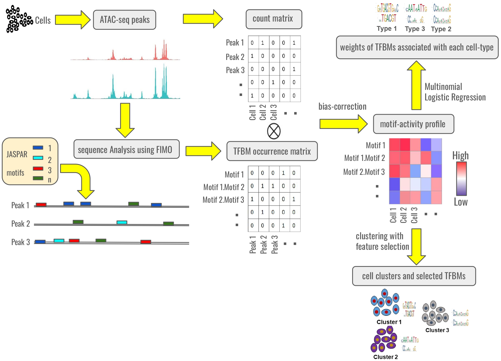

# README


## Overview

Understanding transcriptional regulation at single-cell resolution is key to deciphering cell fate decisions. This project introduces a probabilistic framework that integrates transcription factor binding motif (TFBM) data with single-cell ATAC-seq to uncover regulatory heterogeneity.



- In the **supervised** mode, multinomial logistic regression identifies key motifs and motif-pairs associated with known cell states.  
- In the **unsupervised** mode, a Gibbs sampling model jointly clusters cells and selects informative motifs, enabling de novo discovery of cell states and regulators.

Applied to *Drosophila melanogaster* embryogenesis data, the method accurately recovers known developmental cell types and predicts novel TF combinations relevant to each state.

## 📁 Project Structure

```
project-root/
├── R/
│   └── run_model.R                  # Main R script to run the model
│
├── python/
│   ├── mlr/                         # Supervised analysis using multinomial logistic regression
│   │   └── ...                      # Python scripts for supervised learning
│   └── nplb/                        # Unsupervised analysis and visualization
│       └── ...                      # Python scripts for clustering and plotting
│
├── jaspar_motifs/                  # Motif files in JASPAR format
│   └── ...
├── meme_motifs/                    # Motif files in MEME format
│   └── ...
│
├── data/
│   └── {dataset_name}/             # Dataset-specific input and output files
│
├── slurm_scripts/                  # SLURM job scripts for running on HPC clusters
│   └── ...
```

## Prerequisites

Ensure the following dependencies are installed before running the scripts:

### R Packages:

The required R packages are listed in `R/packages.txt`. Install them using the appropriate R package manager.

### Python Dependencies:

Install the required Python libraries using:

```bash
pip install -r python/requirements.txt
```

### Other Dependencies:

- MEME suite
- bedtools

## Running the Main Pipeline Script 

The main analysis is initiated using the script [`R/run_model.R`](R/run_model.R). Before execution, key parameters must be set manually inside the script. Below is a description of the main parameters and their function:

### Input and Resource Configuration

- `data_dir` *(string)*  
  Path to the dataset directory (e.g., `data/furlong`).

- `n_cores` *(integer)*  
  Number of cores to use for parallelization.

### Feature Construction Options

- `FIMO`:  
  Set to `TRUE` to use FIMO-predicted motif occurrences within peak regions (recommended for precise motif mapping).

- `withPairs`:  
  Set to `TRUE` to construct features based on **motif-pair co-occurrences** within peak regions.  
  This includes both:
  - **Distinct motif-pairs** (e.g., *A.B*)
  - **Self-pairs** (e.g., *A.A*, i.e., multiple instances of the same motif)

- `same`:  
  Used only when `withPairs = TRUE`.  
  Set to `TRUE` to **include same-motif co-occurrence pairs** (e.g., *A.A*) that occur **at least twice** within a peak region.

### chromVAR-Inspired Motif Activity Pipeline

These parameters control steps modeled after the [chromVAR](https://bioconductor.org/packages/release/bioc/html/chromVAR.html) package:

####   Preprocessing
- `chromVAR_preproc` *(boolean)*  
  If `TRUE`, filters out low-quality peaks and cells based on coverage thresholds as in chromVAR.

####   Normalization
- `chromVAR_norm` *(boolean)*  
  If `TRUE`, normalizes accessibility signal (e.g., read depth normalization) before correcting for GC content and PCR bias.

####   Bias Correction
- `bias_correct` *(boolean)*  
  If `TRUE`, applies bias correction for GC content and technical variability using chromVAR's strategy.

####   Post-processing
- `chromVAR_postproc` *(boolean)*  
  If `TRUE`, removes redundant or uninformative features based on low variability or high correlation across cells in the motif activity matrix.

####   Clustering 
- `chromVAR_downstream` *(boolean)*  
  Applies chromVAR-style clustering pipeline:  
  1. Computes a cell-by-cell similarity matrix using 1 − Pearson correlation of motif activity profiles.  
  2. Performs hierarchical clustering on this matrix to group cells into clusters.

### Analysis Modes

- `cisTopic` *(boolean)*  
  If `TRUE`, applies the cisTopic framework directly to the binarized ATAC-seq peak-by-cell matrix to uncover latent topics.

- `topic_modeling` *(boolean)*  
  If `TRUE`, applies cisTopic to the binarized motif activity matrix (computed from chromVAR or motif-pair signal aggregation).

- `n_seeds_cisTopic` *(integer)*  
  Number of independent random seeds used when running cisTopic (for stability/reproducibility).

- `binary` *(boolean)*  
  If TRUE, binarizes the ATAC-seq peak matrix before downstream analysis (required by cisTopic).

---

Once parameters are set, the script can be run using any R environment:

```bash
Rscript R/run_model.R
```

### Running on a Cluster

Instead of running the R script manually, use the SLURM job script:

```bash
cd slurm_scripts/
sbatch script_run_model.sh
```

## Data Structure `data/{dataset_name}/`

1. `dataset.RData` - A sparse matrix with ATAC-seq count values (columns as cell barcodes, rows as ATAC-seq peaks).
2. `labels.RData` - Vector of integer-encoded ground-truth labels.
3. `bed_file.bed` - BED file of peak coordinates.
4. `regions.fa` - FASTA of peak regions for FIMO motif search.
5. `genome_org.txt` - Two-line file specifying genome name in BSgenome format (e.g., `BSgenome.Hsapiens.UCSC.hg38`) and organism name.
6. `lib_size.RData` - Library sizes of samples. Required if using `chromVAR_preproc` is `TRUE`.

Additionally, the following motif files must be present:

- `jaspar_motifs/{organism_name}.txt` - List of motifs in JASPAR format.
- `meme_motifs/{organism_name}.meme` - List of motifs in MEME format.

## Supervised Analysis

This module uses multinomial logistic regression to quantify the importance of motifs and motif pairs in predicting known cell states. It supports multiple cross-validation runs and produces precision metrics and feature weights.

All supervised analyses are located in `python/mlr/`. These scripts perform classification using motif activity features. You can run them either directly or through SLURM job scripts `slurm_scripts/` (examples provided). If SLURM is unavailable, simply run the corresponding Python commands manually by providing the required arguments.

### 1. Multiple Logistic Regression Across Multiple Runs

This script performs K-fold cross-validation across multiple runs to assess classifier performance.

**Direct command:**
```bash
python3 python/mlr/run_mlr_precision_full_kfold_multiple_runs.py <motif_activity_file_csv> <labels_csv>
```

**SLURM example:**
```bash
cd slurm_scripts/
sbatch script_run_mlr_precision_full_kfold_multiple_runs.sh
```

---

### 2. Plot Error Bars for MLR Performance

Generates error bar plots for precision values across multiple runs.

**Direct command:**
```bash
python3 python/mlr/plot_error_bars.py <pairs_precision_results_pkl> <individual_precision_results_pkl> <cell_types_csv>
```

**SLURM example:**
```bash
sbatch script_plot_error_bars.sh
```

---

### 3. MLR with Feature Weight Output

Runs MLR and saves the feature weights for each cell type for downstream interpretation.

**Direct command:**
```bash
python3 python/mlr/run_mlr_feature_weights_full.py <motif_activity_file_csv> <labels_csv>
```

**SLURM example:**
```bash
sbatch script_run_mlr_feature_weights_full.sh
```

---

### 4. Plot Important Motif Features

Plots motif pairs and individual motifs with high weights, highlighting discriminative features across cell types.

**Direct command:**
```bash
python3 python/mlr/plot_imp_motifs.py <pairs_feature_weights_pkl> <individual_feature_weights_pkl>
```

**SLURM example:**
```bash
sbatch script_plot_imp_motifs.sh
```

---

## Unsupervised Analysis 

The Non-Parametric Latent Binding (NPLB) module uses a Gibbs sampler-based probabilistic model to perform de novo clustering of cells in the space of motif activity, simultaneously identifying informative motifs for each cluster. This allows regulatory heterogeneity to emerge directly from the data.

Unsupervised analysis scripts are in `python/nplb/` and the corresponding SLURM job submission scripts can be found in `slurm_scripts/`. These typically include clustering evaluation and visualizations like confusion matrices.

### Plot Confusion Matrix and Heatmap

Evaluates model prediction against true labels, visualized as a confusion matrix and cell type-specific heatmap.

**Direct command:**
```bash
python3 python/nplb/plot_nplb_confusion_matrix_heatmap.py <model_arch_txt> <model_output_txt> <labels_csv> <motifs_csv> <cell_types_csv>
```

**SLURM example:**
```bash
sbatch script_plot_nplb_confusion_matrix_heatmap.sh
```
> *Note: The unsupervised analysis code (NPLB) is currently being finalized for release and will be added to the public repository shortly.*

## Troubleshooting

- **R script fails due to missing packages:** Ensure all R dependencies are installed using Bioconductor and CRAN.
- **Python script errors (e.g., ImportError):** Check that all dependencies are installed via `pip install -r python/requirements.txt`.
- **Incorrect file paths:** Ensure dataset-specific files exist in `data/{dataset_name}/` and paths in scripts are correctly set.
- **Memory issues:** If encountering memory errors, reduce the dataset size or adjust memory allocation parameters.
- **Multithreading issues:** Ensure `n_cores` is set appropriately for available CPU resources.
- **Unexpected results:** Double-check input files, parameter settings, and preprocessing steps.

For any persistent issues, refer to error logs and confirm all input files and dependencies are correctly set up.

